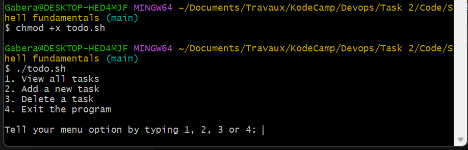
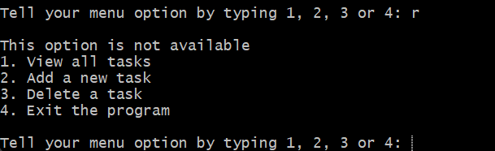
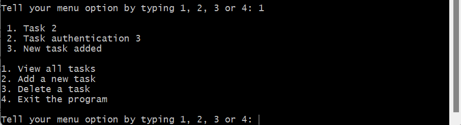
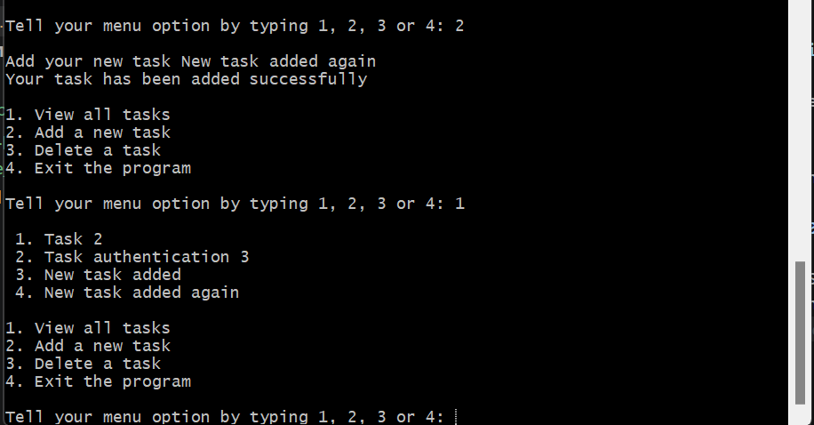
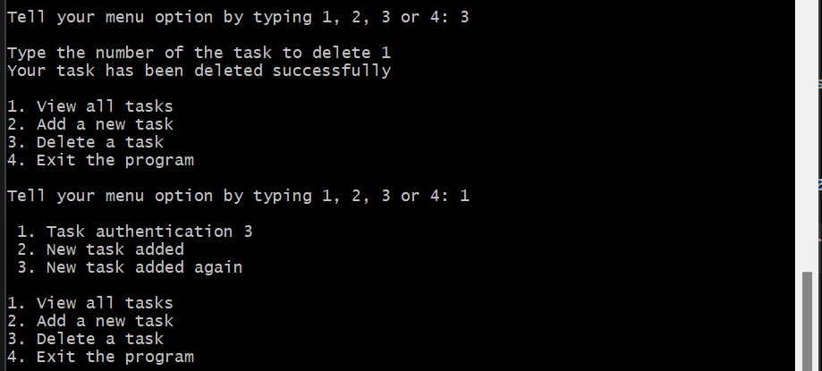
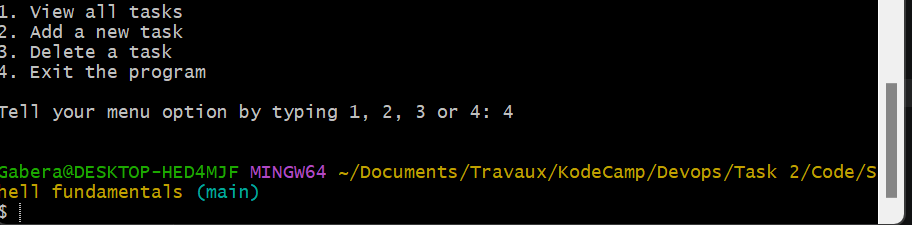

This shell program manages a todo list. The user can add, view, delete tasks using the terminal.  
In the following, we will see, step by step, how to run this program and its results. 
Step 1: Run the program  
First we open Git bash and change the directory to the place where todo.sh is.  

  
   
  <em>Figure 1: we make the todo.sh file an executable and then we run it </em>

Step 2: Test by typing poor inputs 
Once the program is run, the menu with 4 options is shown. The user is required to type a number between 1 and 4 to progress. Otherwise he is prompted again to type a good input. 

  
   
  <em>Figure 2: The user types a bad input. So he is prompted again to type a good input among the options he has </em>

Step 3: Test the first option 
To test the first option, the user has to type 1 to view all the tasks available in the todo.txt file(located in the user root directory). 

  
   
  <em>Figure 3: By typing 1, the user can see all the tasks</em>

Step 4: Test the second option 
When typing 2, the user can add a new task in the file. 

  
   
  <em>Figure 4: By typing 2, the user types a new task. Then he types 1 to see that the task has been added. </em>

Step 5: Test the third option 
When typing 3, the user chooses to delete a task. He is prompted again to type the number of the task he wants to delete.

  
   
  <em>Figure 5: After typing 3, the user chooses to delete a task. Then he chooses to delete the task 1 which is "Task 2". We then see it is deleted</em>

Step 6: Test the fourth option 
When typing 4, the user chooses to exit the program.

  
   
  <em>Figure 6: After typing 4, the user exits the program.</em>

Note that the only way to stop the program is to type 4 in the menu. Otherwise, the program keeps on running.